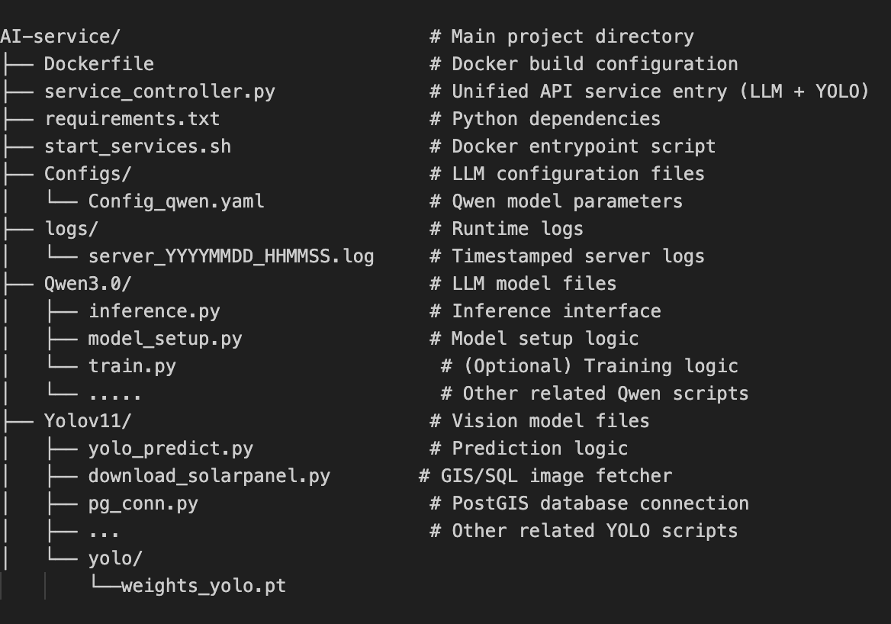
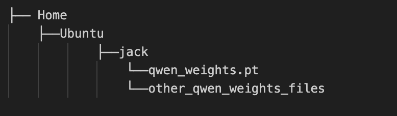

# AI-Container 使用说明  

## 该源代码目前在 /home/ubuntu/jack/LLM_Container AWS EC2 服务器上, docker image名称为my-ai-container  

## 一、简介
本仓库提供了一份可打包成 Docker 容器的 AI 服务模板，包含：

- **Dockerfile**：构建镜像所需指令  
- **requirements.txt**：所需 Python 第三方依赖  
- **start_services.sh**：启动服务的 Bash 脚本  
- **service_controller.py**：调度 Qwen3.0 与 Yolov11 模型的主控脚本  
- **llm_models/**  
  - `Qwen3.0/`：Qwen3.0 模型及工具包  
  - `Yolov11/`：Yolov11 模型及工具包  
- **logs/**：每次运行日志（包括报错、调试信息）  
- **configs/**  
  - `Config_qwen.yaml`：Qwen3.0 参数配置文件  
  
  **备注：如果在运行前遇到了conflict有可能是docker容器已在运行的冲突，需要先docker rm my-ai-container再运行接下来的服务器启动容器命令

---

## 二、目录结构

容器目录  

  

qwen外部权重目录  



---

## 三、配置说明

1. **模型权重目录**  
   - 本地路径：`/home/ubuntu/jack/qwen3_lora_merged`  
   - 容器内路径：`/app/qwen_llm/qwen3_lora_merged`  
   - 如需更换路径，只需替换主机端路径，容器内部路径保持不变。

2. **端口映射**  
   - 容器内服务监听在 `5000` 端口，使用 `-p 5000:5000` 将其映射至主机。

---

## 四、快速启动命令

### 1. 在服务器上启动容器

```bash
docker run --gpus all 
  -p 5000:5000 
  -v /home/ubuntu/jack/qwen3_lora_merged:/app/qwen_llm/qwen3_lora_merged 
  --name my-ai-container 
  my-ai-container dispatch

"/home/ubuntu/jack/qwen3_lora_merged"为qwen所需要的权重路径,该路线是ec2服务器上的路径, 该文件很大因此从外面挂上去，如果在另外一台服务器上需要指明新的权重路径  
“/app/qwen_llm/qwen3_lora_merged”不变  
“my-ai-container”为容器名字  
“dispatch”为运行命令启动service_controller.py核心运行文件  


### 2. 在本地测试文字接口
curl -X POST 
  http://<SERVER_IP>:5000/predict 
  -H "Content-Type: application/json" 
  -d '{"question": "What is the minimal value of y=5*x^2 + 7x + 75"}'  
<SERVER_IP>：替换为服务器公网 IP  
question 字段可替换为任意提问内容  

### 3. 在本地测试图像识别（返回 JSON）
curl -X POST 
  -F "image=@your_image.jpg" 
  http://<SERVER_IP>:5000/predict  
上传 your_image.jpg，终端将打印识别结果（太阳能板检测信息、置信度、时间戳等） 

### 4. 在本地测试图像识别（下载带标注图片）
curl -X POST 
  -F "image=@your_image.jpg" 
  http://<SERVER_IP>:5000/image 
  --output annotated_result.jpg  
同样上传 your_image.jpg，在目前路径下会返回annotated_results.jpg(Yolo模型处理后的图片)  

### 5. 隐藏bonus 具体指令请查看start_services.sh 
    qwen模型bonus:    
    该容器内还包括data_prep.py, model_setup.py, 和train.py, 可以一键指令在容器内部训练自己的模型存储自己的权重（但是如果模型过大不推荐）  
  
    Yolov11模型bonus:  
    该容器可以训练gis数据库里指定的国家地图区域，识别每一个区域的太阳能板房屋信息并储存到后段sql库里, 具体信息请咨询zhang gang
